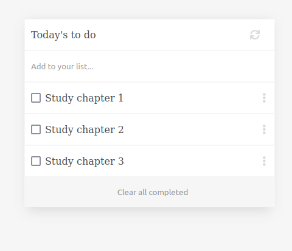

# To Do List

> "To-do list" is a tool that helps to organize your day. It simply lists the things that you need to do and allows you to mark them as complete.

This website is built using ES6 and Webpack!

## Below is a PNG showing the app

## Live Demo

You can see [the app live here](https://sahar-abdelsamad.github.io/To-do-list/dist/)

## Built With

- HTML, CSS, JavaScript, Webpack.

## To get a local copy up and running follow these simple example steps.

### Setup

Clone the repository using `git clone` and pasting the following link [git@github.com:Sahar-AbdelSamad/To-do-list.git](git@github.com:Sahar-AbdelSamad/To-do-list.git). Clone it in your desired location on your computer.
 
### Install

Run the command `npm install` to install all project's dependencies.

### Deployment

Run the command line `npm start`, the basic template will automatically open the index.html file in a browser.
Distribution files are generated by webpack and served by webpack dev server from /dist folder.

## Authors

👤 **Sahar Abdel Samad**

- GitHub: [@sahar-abdelsamad](https://github.com/Sahar-AbdelSamad)
- Twitter: [@abdelsamadsahar](https://twitter.com/AbdelSamadSahar)
- LinkedIn: [abdel-samad-sahar](https://www.linkedin.com/in/abdel-samad-sahar-353977223/)

## 🤝 Contributing

Contributions, issues, and feature requests are welcome!

Feel free to check the [issues page](https://github.com/Sahar-AbdelSamad/To-do-list/issues).

## Show your support

Give a ⭐️ if you like this project!
